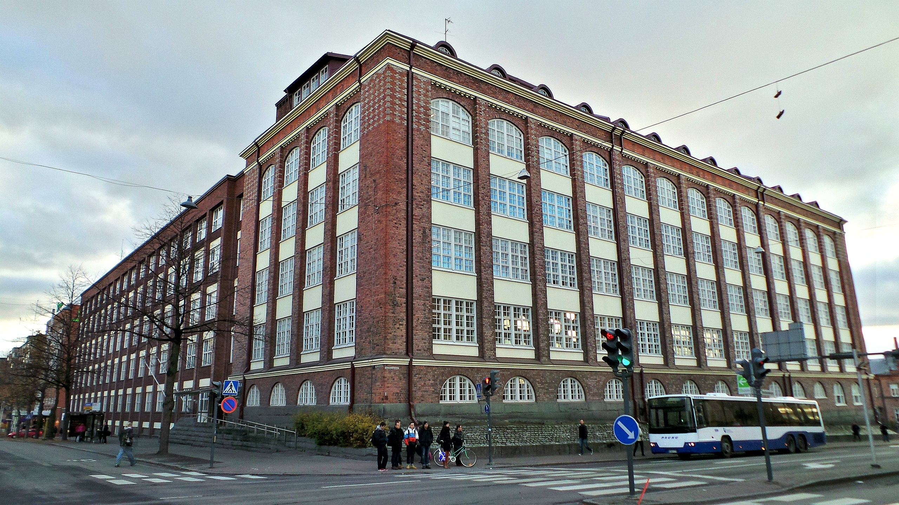
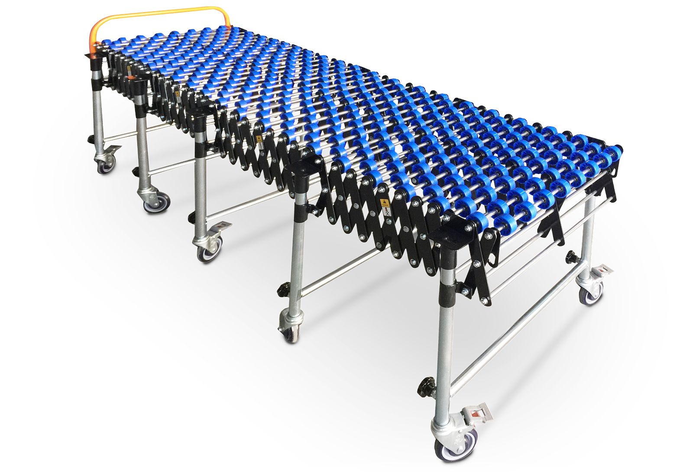

# Render

## Version 1

### Building

Version 1 consisted of a factory building populated by some conveyor belts. The building was a standard cuboid with large glass windows and lattices on the windows modelled after old style factory buildings.

### Conveyor Belt

The conveyor belt was modelled after conveyor belts seen in places such as airports and delivery centers.

## Version 2

### World

The world is a flat plane with scattered trees and a clearing in the middle, with two tone grass on the ground the environment looks simple yet overgrown. The trees are modelled from my imagination with a few branches scattering out from the trunk as it goes further up, with a set of iso-spheres being used as leaves. The grass is made up of planes which have been deformed to create an s bend in the middle and they are narrowed towards the top. The grass is made up of a green and a brown material which is randomly assigned due to the particle system randomly generating grass on the ground. The trees are similar too, where they are randomly generated around the edge of the plane and have a brown colour for the trunk and a green for the leaves.

### Conveyor

This conveyor is similar to the last model however it has been lowered and only has one central leg rather than 4 legs.

### Claw

The claw was modelled after the inserter from the game factorio which is very similar to a robotic arm with at least 3 degrees of freedom. The inserters a split into 6 pieces which each have their own seperate animation but move as a group. The Claws are a two toned design with a dark blue/grey and a red making up their materials.

### Machine

The machines are a design that I randomly put together after messing with a cube and some cylinders. They are split in have for two textures the lower being a dark blue/grey and the upper being a yellow colour.

### Lamps

The lamps are a dark thin cylinder with a glass sphere at the top in a cage make of cylinders.

### Fog

The fog is a volume BSDF from a gradient texture into a color ramp.

# Output

Number of samples: 2048
Progressive rendering
Cycles
4k Image

